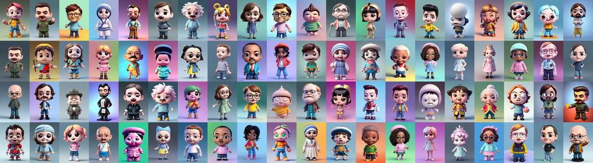

# Dynamic Prompts


&nbsp;-&nbsp;

[](https://app.codecov.io/gh/adieyal/dynamicprompts)
&nbsp;-&nbsp;
[](https://pypi.org/project/dynamicprompts) 


Dynamic prompts is a Python library that provides developers with a **flexible and intuitive templating language** and **tools** for generating prompts for text-to-image generators like Stable Diffusion, MidJourney or Dall-e 2. It lets you create and manage **sophisticated prompt generation workflows** that seamlessly integrate with your existing text-to-image generation pipelines.



It includes:
* An easy-to-learn templating language that lets you create a number of unique prompts from a single template.
* Support for wildcard files as placeholders in templates.
* A mechanism for creating a wildcard library. Text, JSON, and YAML files are supported.
* Exhaustive generation of all prompts from a template.
* Variable assignment enabling re-usable prompt snippets.
* Supports Magic Prompt which automatically spices up your prompt with modifiers
* Provides an I'm Feeling Lucky feature which uses the semantic search on Lexica.art to find similar prompts.
* For systems that support attention syntax, Attention Grabber will emphasis random phrases in your prompt.
* Jinja-powered templating for advanced prompt creation.

The dynamic prompts library powers the [Dynamic Prompts](https://github.com/adieyal/sd-dynamic-prompts) extension for Automatic1111.

## Table of contents

* [Dynamic Prompts](#dynamic-prompts)
   * [Quick overview of the templating language:](#quick-overview-of-the-templating-language)
      * [Variants](#variants)
      * [Choosing multiple variants](#choosing-multiple-variants)
      * [Wildcards](#wildcards)
      * [Let's try a real-world prompt](#lets-try-a-real-world-prompt)
      * [Use whitespace for readability](#use-whitespace-for-readability)
   * [Installation](#installation)
   * [Quick Start](#quick-start)
      * [Combinatorial Generation](#combinatorial-generation)
      * [Magic Prompt](#magic-prompt)
       * [I'm feeling lucky](#im-feeling-lucky)
       * [Attention Generator](#attention-generator)
    * [Jinja2 templates](#jinja2-templates)
    * [Template syntax](#template-syntax)
      * [Syntax customisation](#syntax-customisation)
    * [Wildcard Collections](#wildcard-collections)
    * [Dynamic Prompts in the wild.](#dynamic-prompts-in-the-wild)


## Quick overview of the templating language:

### Variants
```
{summer|autumn|winter|spring} is coming
```
Randomly generate one of:
```
summer is coming
autumn is coming
winter is coming
spring is coming
```

### Choosing multiple variants
This syntax `{2$$ and $$A|B|C}` will choose two values from the list:
```
A and B
A and C
B and A
B and C
C and A
C and B
```

### Wildcards
```
__season__ is coming
```
Randomly selects a value from season.txt in your wildcard directory.


### Let's try a real-world prompt
One prompt template can generate a family of prompts:

```
Funky pop {yoda|darth vader|jabba the hutt|princess leia|chewbacca|luke skywalker} figurine, made of {wood|plastic|metal|stone}, product studio shot, on a white background, diffused lighting, centered
```


<br/>


Now, how about two characters at the same time:

```
Funky pop {2$$ and $$yoda|darth vader|jabba the hutt|princess leia|chewbacca|luke skywalker} figurine, made of {wood|plastic|metal|stone}, product studio shot, on a white background, diffused lighting, centered
```


<br/>

### Use whitespace for readability
```
# Add comments like this
Funky pop
    {2$$ and $$
  	    yoda
		|darth vader
		|jabba the hutt
		|princess leia
		|chewbacca
		|luke skywalker
	}
	figurine, made of
	{
		wood
		|plastic
		|metal
		|stone
	}, product studio shot, on a white background, diffused lighting, centered
```


Use wildcards for re-usable lists:

```
# starwars.txt
yoda
darth vader
jabba the hutt
princess leia
chewbacca
luke skywalker
```

```
# material.txt
wood
plastic
metal
stone
```

```
# studio-shot.txt
product studio shot, on a white background, diffused lighting, centered
```

Now compose your prompt like this:
```
Funky pop __starwars__ figurine, made of __material__, __studio-shot__
```

and easily change it to:
```
Funky pop __celebrities__ figurine, made of __material__, __studio-shot__
```


Hat tip to [publicprompts](https://publicprompts.art/) for the funky pop prompt.

The complete syntax can be found [here](https://github.com/adieyal/sd-dynamic-prompts/blob/main/docs/SYNTAX.md).


## Installation

`pip install dynamicprompts`

Additional functionality (see below) can be installed with this command:

`pip install "dynamicprompts[magicprompt, attentiongrabber]"`

## Quick Start

Use the RandomPromptGenerator to create 5 random prompts using a given template:

```python
from dynamicprompts.generators import RandomPromptGenerator

generator = RandomPromptGenerator()
generator.generate("I love {red|green|blue} roses", num_images=5)

>> ['I love blue roses', 'I love red roses', 'I love green roses', 'I love red roses', 'I love red roses']
```

If you want to use wildcards, instantiate a WildcardManager:

```python
from pathlib import Path
from dynamicprompts.generators import RandomPromptGenerator
from dynamicprompts.wildcards.wildcard_manager import WildcardManager

wm = WildcardManager(Path("/path/to/wildcard/directory"))

generator = RandomPromptGenerator(wildcard_manager=wm)
```

Assuming you have a file called colours.txt in /path/to/wildcards/directory with one colour per line, e.g.

```
red
green
blue
purple
yellow
```

then

```python
generator.generate("I love __colours__ roses", num_prompts)
>> ['I love pink roses', 'I love violet roses', 'I love white roses', 'I love violet roses', 'I love blue roses']
```

### Random seeds

You can pass a random seed in the constructor for predictable outputs
```
generator = RandomPromptGenerator(wildcard_manager=wm, seed=999)
```

A list of seeds can also be provided in the `generate` method.

```
generator.generate("I love __colours__ roses", num_prompts, seeds=[1,2,3])
```
In this example, a seed is provided for each prompt generated. The number of seeds must equal the number of prompts, i.e. `len(seeds) == num_prompts`. If `len(seeds) == 1` then the same seed is used for every image.

As a convenience, `seeds` may also be an int value.

```
generator.generate("I love __colours__ roses", num_prompts=3, seeds=5)
```

is equivalent to:
```
generator.generate("I love __colours__ roses", num_prompts=3, seeds=[5, 5, 5])
```

### Combinatorial Generation
Instead of generating random prompts from a template, combinatorial generation produces every possible prompt from the given string. For example:

`I {love|hate} {New York|Chicago} in {June|July|August}`

will produce:
> I love New York in June<br>
> I love New York in July<br>
> I love New York in August<br>
> I love Chicago in June<br>
> I love Chicago in July<br>
> I love Chicago in August<br>
> I hate New York in June<br>
> I hate New York in July<br>
> I hate New York in August<br>
> I hate Chicago in June<br>
> I hate Chicago in July<br>
> I hate Chicago in August<br>

If a `__wildcard__` is provided, then a new prompt will be produced for every value in the wildcard file. For example:

`My favourite season is __seasons__`

will produce:
> My favourite season is Summer<br>
> My favourite season is August<br>
> My favourite season is Winter<br>
> My favourite season is Sprint<br>

#### Usage

```python
from dynamicprompts.generators import CombinatorialPromptGenerator

generator = CombinatorialPromptGenerator()
generator.generate("I love {red|green|blue} roses", max_prompts=5)

>> ['I love red roses', 'I love green roses', 'I love blue roses']
```

Notice that only 3 prompts were generated, even though we requested 5. Since there are only three options, i.e. red, green, and blue, only 3 unique prompts can be created. `num_prompts` in this case acts as an upper bound. Combinatorial generation can very quickly produce many more prompts than you intended. `num_prompts` is a safeguard to ensure that you don't accidentally produced thousands or tens of thousands of prompts.

Consider this template:

`My favourite colours are __colours__, __colours__, and __colours__`

If colours.txt contains 10 different colours, a combinatorial enumeration of that template will create `10 * 10 * 10 = 1000` different prompts. e.g.

> My favourite colours are red, green, and blue<br>
> My favourite colours are red, green, and yellow<br>
> My favourite colours are red, green, and purple<br>
> My favourite colours are red, blue, and yellow<br>
> My favourite colours are red, blue, and purple<br>
> ...<br>


### Magic Prompt
Using [Gustavosta](https://huggingface.co/Gustavosta/MagicPrompt-Stable-Diffusion)'s MagicPrompt model, automatically generate new prompts from the input. Trained on 80,000 prompts from [Lexica.art](lexica.art), it can help give you interesting new prompts on a given subject. Here are some automatically generated variations for "dogs playing football":

> dogs playing football, in the streets of a japanese town at night, with people watching in wonder, in the style of studio ghibli and makoto shinkai, highly detailed digital art, trending on artstation<br>
> dogs playing football, in the background is a nuclear explosion. photorealism. hq. hyper. realistic. 4 k. award winning.<br>
> dogs playing football, in the background is a nuclear explosion. photorealistic. realism. 4 k wideshot. cinematic. unreal engine. artgerm. marc simonetti. jc leyendecker<br>

This is compatible with the wildcard syntax described above.

#### Usage

```python
from dynamicprompts.generators import RandomPromptGenerator
from dynamicprompts.generators.magicprompt import MagicPromptGenerator

generator = RandomPromptGenerator()
magic_generator = MagicPromptGenerator(generator, device=0) # device = 0 for CUDA or -1 for CPU

num_prompts = 5
generator.generate("I love {red|green|blue} roses", num_prompts)

>> ['I love red roses trending on artstation #vividart #pixiv', 'I love red roses trending on artstation artwork', 'I love blue roses breakfast club, cute, intricate, highly detailed, digital painting, artstation, concept art, smooth, sharp focus, illustration, unreal engine 5, 8 k, art by artgerm and greg rutkowski and alphonse mucha', 'I love green roses I love green flowers, smile, Tristan Eaton, victo ngai, artgerm, RHADS, ross draws', 'I love red roses smile, Tristan Eaton, victo ngai, artgerm, RHADS, ross draws']

```

The first time you use it, the model is downloaded. It is approximately 500mb and so will take some time depending on how fast your connection is. It will also take a few seconds on first activation as the model is loaded into memory. Note, if you're low in VRAM, you might get a Cuda error. My GPU uses less than 8GB by YMMV.

Magic Prompt is not available by default, you need to install it as follows:

`pip install "dynamicprompts[magicprompt]"`

#### Other models
There a few alternatives to Gustavosta's model available. You can try:

```
magic_generator = MagicPromptGenerator(generator, "AUTOMATIC/promptgen-lexart")
magic_generator = MagicPromptGenerator(generator, "AUTOMATIC/promptgen-majinai-safe")
magic_generator = MagicPromptGenerator(generator, "AUTOMATIC/promptgen-majinai-unsafe")
```

You can find a longer list [here](https://github.com/adieyal/sd-dynamic-prompts/blob/main/config/magicprompt_models.txt)
Note that each model requires a download of large model files.

### I'm feeling lucky
Use the [lexica.art](https://lexica.art) API to create random prompts. Useful if you're looking for inspiration, or are simply too lazy to think of your own prompts. When this option is selected, the template is used as a search string. For example, prompt "Mech warrior" might return:

> A large robot stone statue in the middle of a forest by Greg Rutkowski, Sung Choi, Mitchell Mohrhauser, Maciej Kuciara, Johnson Ting, Maxim Verehin, Peter Konig, final fantasy , 8k photorealistic, cinematic lighting, HD, high details, atmospheric,

> a beautiful portrait painting of a ( ( ( cyberpunk ) ) ) armor by simon stalenhag and pascal blanche and alphonse mucha and nekro. in style of digital art. colorful comic, film noirs, symmetry, brush stroke, vibrating colors, hyper detailed. octane render. trending on artstation

> symmetry!! portrait of a robot astronaut, floral! horizon zero dawn machine, intricate, elegant, highly detailed, digital painting, artstation, concept art, smooth, sharp focus, illustration, art by artgerm and greg rutkowski and alphonse mucha, 8 k


#### Usage

```python
from dynamicprompts.generators import RandomPromptGenerator
from dynamicprompts.generators.feelinglucky import FeelingLuckyGenerator

generator = RandomPromptGenerator()
lucky_generator = FeelingLuckyGenerator(generator)

num_prompts = 5
lucky_generator.generate("I love {red|green|blue} roses", num_prompts)

>> ['“ guns and roses ” ', '🌹🥀🏜. 🌌🌠⭐. 💯. ', 'tattoo design, stencil, beautiful japanese girls face, roses and ivy surrounding by artgerm, artgerm, cat girl, anime ', 'rose made of glass dramatic lighting', 'a wireframe render of a red rose']

```

### Attention Generator
If you are using [Automatic1111](https://github.com/AUTOMATIC1111/stable-diffusion-webui/) or a similar frontend to Stable Diffusion that uses attention syntax, e.g. `(some text:1.4)`, AttentionGenerator will randomly add attention to various phrases in your prompt. This injects a small amount of randomness into your prompt.

#### Usage

```python
from dynamicprompts.generators import RandomPromptGenerator
from dynamicprompts.generators.attentiongenerator import AttentionGenerator

generator = RandomPromptGenerator()
attention_generator = AttentionGenerator(generator)

prompt = "a portrait an anthropomorphic panda mage casting a spell, wearing mage robes, landscape in background, cute, dnd character art portrait, by jason felix and peter mohrbacher, cinematic lighting"
attention_generator.generate(prompt, num_prompts=1)

>> ['a portrait an anthropomorphic panda mage casting a spell, wearing (mage robes:0.77), landscape in background, cute, dnd character art portrait, by jason felix and peter mohrbacher, cinematic lighting']

```


Note, AttentionGenerator is not installed by default as it needs additional libraries to run. Use this command to install it:

`pip install "dynamicprompts[attentiongrabber]"`

One your first use it, a model will automatically be downloaded.

## Jinja2 templates
If the standard template language is not sufficient for your needs, you can try the Jinja2 generator. Jinja2 templates have familiar programming constructs such as looping, conditionals, variables, etc. Youcan find a guide on using Jinja2 templates with Dynamic Prompts, [here](https://github.com/adieyal/sd-dynamic-prompts/blob/main/jinja2.md). Here is the minimal code you need to instantiate Jinja2 generator.

```python
from dynamicprompts.generators import JinjaGenerator

generator = JinjaGenerator()
generator.generate("I love {red|green|blue} roses", num_images=5)

template = """

    I love {{ colour }} roses

"""

generator.generate(template)

>> ['I love red roses', 'I love blue roses', 'I love green roses']
```

## Template syntax

You can find the complete syntax guide [here](https://github.com/adieyal/sd-dynamic-prompts/blob/main/docs/SYNTAX.md)

### Syntax customisation
To address potential syntax clashes with other tools it is possible to change various tokens. Instead of `{red|green|blue}` you can configure the library to use the `<` `>` pair instead, e.g. `<red|green|blue>`. You can also change the `__` used in wildcards. So instead of `__colours__`, you can configure wildcards to use `**`, e.g. `**colours**`
```python

from dynamicprompts.generators import RandomPromptGenerator
from dynamicprompts.parser.config import ParserConfig

parser_config = ParserConfig(variant_start="<", variant_end=">", wildcard_wrap="**")
generator = RandomPromptGenerator(parser_config=parser_config)

```
## Wildcard Collections
You can bootstrap your wildcard library by using our [pre-existing collections](https://github.com/adieyal/sd-dynamic-prompts/tree/main/collections). You'll find just under 80,000 wildcards divided into 1900 files. Feel free to pick and choose or take them in their entirety.

## Dynamic Prompts in the wild.
Dynamic Prompts has been used in:
1. [SD Dynamic Prompts](https://github.com/adieyal/sd-dynamic-prompts/edit/main/README.md) Auto1111 extension
2. Deforum 0.7 [colab](https://colab.research.google.com/drive/1qtYHUwFl9ocLyzDRL1_MlpQluV32ndoT?usp=sharing)
